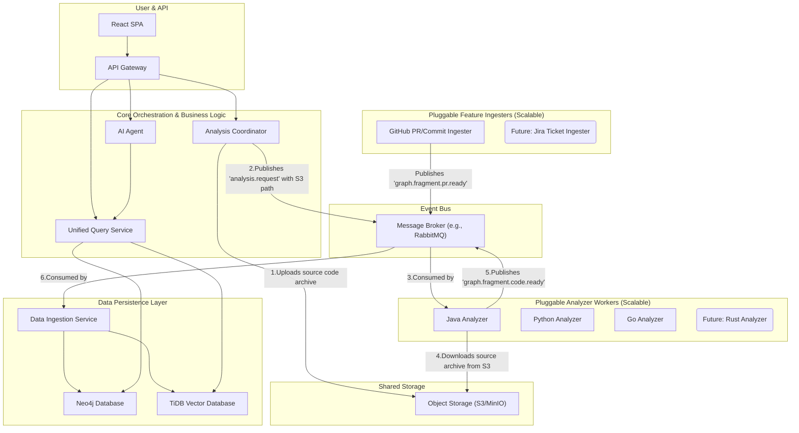

    </img>

# RepoDive: Navigate Your Codebase with AI-Powered Precision

**RepoDive** is an innovative codebase analysis platform designed to transform how developers understand complex and intricate software repositories. Forget endless `grep` commands and manual tracing – RepoDive provides interactive, multi-layered abstractions, logic & data flow visualizations, and AI-driven insights to make even the most sophisticated systems intuitively navigable.

---

## 🚀 What is RepoDive?

In today's fast-paced development world, understanding a new or inherited codebase is a significant bottleneck. RepoDive tackles this challenge head-on by offering a holistic, deep-dive perspective into your repository. Whether you're dealing with large-scale systems like FastAPI, Redis, Nginx, or Postgres, or your personal frontend-backend stack (e.g., React JS frontend with Golang backend), RepoDive unearths the hidden structures and dynamic flows.

Our goal is to **significantly reduce the time and effort required for code comprehension**, enabling developers, new team members, and architects to quickly grasp complex systems and contribute effectively.

---

## ✨ Key Features

RepoDive provides an unparalleled level of code insight through its unique multi-layered approach and intelligent capabilities:

*   **Multi-Layered Abstraction:** Explore your codebase from a high-level ecosystem view down to individual code symbols.
*   **AI-Powered Architecture Discovery:** Our integrated AI Agent intelligently analyzes your codebase to automatically determine and visualize system architecture and component boundaries.
*   **Interactive Flow Visualizations:** Understand complex logic and data flows with dynamically generated sequence diagrams and component interaction graphs.
*   **Semantic Code Search:** Leverage TiDB as a vector database for intelligent, meaning-based code search, finding relevant code snippets even if you don't know the exact keywords.
*   **Code Symbol Graph:** Dive into the most granular level with a comprehensive graph of all code symbols (methods, classes, functions, variables) and their intricate relationships.
*   **Pluggable Language Support:** Designed for easy expansion to support new programming languages and frameworks.
*   **Contextual Feature Integration:** Ability to integrate non-code context like GitHub Pull Requests or Jira tickets directly into the codebase graph for richer understanding.

---

## 🏗️ Architecture Overview

RepoDive is built on a scalable, modular, and event-driven microservices architecture. This design ensures high performance, extensibility, and resilience for analyzing codebases of any size.

**Key Components:**

*   **Analysis Coordinator:** Initiates analysis requests, detects languages, and orchestrates the process by archiving source code to the `ObjectStore` and publishing messages to the `MessageBroker`.
*   **Pluggable Analyzer Workers:** Dedicated microservices (e.g., `JavaAnalyzer`, `PythonAnalyzer`) that are experts in analyzing a single programming language. They consume analysis requests from the `MessageBroker`, download source code from the `ObjectStore`, perform static analysis, and publish canonical graph fragments back to the `MessageBroker`. The base will be using `cased/kit`, This are looking for expert contributor to help out in this for different languages.
*   **Pluggable Feature Ingesters:** Services (e.g., `GitHubIngester`) that pull in external, non-code context (like PRs, commits, Jira tickets) and convert them into graph fragments, enriching the codebase graph.
*   **Data Ingestion Service:** The sole writer to our persistent databases. It consumes all graph fragments from the `MessageBroker` and efficiently populates Neo4j and TiDB.
*   **Neo4j Graph Database:** Stores the intricate code symbol graph, representing relationships like function calls, class inheritance, and variable usage.
*   **TiDB Vector Database:** Stores vector embeddings of code snippets, enabling advanced semantic search and similarity matching, powered by state-of-the-art code-aware AI models (e.g., CodeBERT).
*   **AI Agent:** The intelligent "brain" that queries the graph and vector databases, performs architectural pattern recognition, generates logic flows, and enables natural language search.
*   **Unified Query Service:** Provides a consistent API layer for the `AI Agent` and `Frontend` to retrieve data from Neo4j and TiDB.
*   **Object Storage (S3/MinIO):** Acts as a highly scalable, temporary storage for source code archives, facilitating decoupled data sharing between services.
*   **Message Broker (RabbitMQ/Kafka):** Enables asynchronous communication between services, ensuring resilience, independent scaling, and easy extensibility.
*   **Frontend (React SPA):** The interactive user interface for exploring the analyzed codebases, built with React and advanced visualization libraries.

---

## 🛠️ Technology Stack

*   **Frontend:** React, TypeScript, D3.js / React Flow (for visualizations)
*   **Backend Services:** Go (for performance-critical services), Python (for AI Agent)
*   **Static Analysis:** `cased/kit`
*   **Graph Database:** Neo4j
*   **Vector Database:** TiDB
*   **Object Storage:** S3-compatible (e.g., AWS S3, MinIO)
*   **Message Broker:** RabbitMQ / Apache Kafka
*   **Deployment:** Docker, Kubernetes

---

## 🚀 Getting Started

**Note:** RepoDive is currently under active development. Installation and setup instructions will be provided here upon reaching an initial stable release.

**Expected Steps:**
1.  Clone the repository: `git clone https://github.com/your-org/repodive.git`
2.  Set up Docker and Docker Compose (or Kubernetes).
3.  Configure environment variables for database connections, object storage, and message broker.
4.  Run `docker-compose up` (or deploy Kubernetes manifests).
5.  Access the UI via your browser (e.g., `http://localhost:3000`).

---

## 🤝 Contributing

We welcome contributions from the community! Whether it's bug reports, feature requests, documentation improvements, or code contributions, your help is invaluable.

Please see our [CONTRIBUTING.md](CONTRIBUTING.md) for detailed guidelines on how to get started.

---

## 🗺️ Roadmap

*   **Q4 2025:**
    *   Initial MVP with Ecosystem, System Flow, and basic Component Anatomy views.
    *   Robust analysis for Python and Go languages.
    *   Basic natural language code search.
*   **Q1 2026:**
    *   Advanced Logic Flow (Sequence Diagram) generation.
    *   Support for Java and JavaScript/TypeScript.
    *   GitHub PR/Commit integration.
*   **Future:**
    *   Real-time analysis via CI/CD integration.
    *   AI-powered refactoring suggestions.
    *   Team collaboration features.
    *   Support for more programming languages (Rust, C++, C#).

---

## 📄 License

RepoDive is released under the 'Haven't decide'

---

## ❓ Glossary

| Term | Definition |
| :--- | :--- |
| **cased/kit** | An underlying third-party tool for static code analysis, used by RepoSense analyzers to extract raw code information. |
| **Neo4j** | A graph database management system used by RepoDive to store the complex relationships between code symbols (functions, classes, variables, etc.). |
| **TiDB** | A distributed, hybrid transactional and analytical processing (HTAP) database used by RepoDive to store vector embeddings for semantic code search. |
| **Vector Embedding** | A numerical representation of text or code generated by an AI model, designed to capture its semantic meaning in a multi-dimensional space. |
| **AI Agent** | The intelligent component of RepoDive responsible for orchestrating analysis, generating visualizations, and performing semantic understanding tasks using AI models. |
| **Graph Fragment** | A standardized JSON format representing a small, self-contained piece of the overall code graph, used for inter-service communication in the analysis pipeline. |