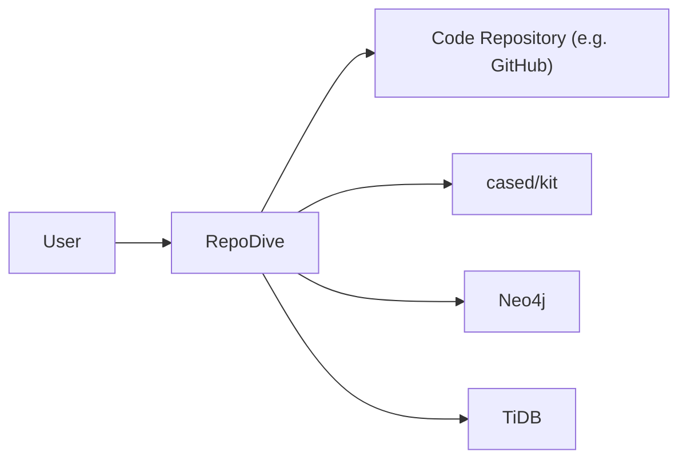
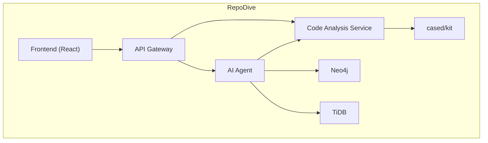
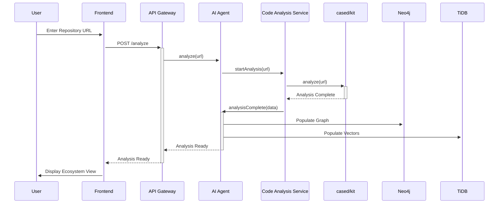
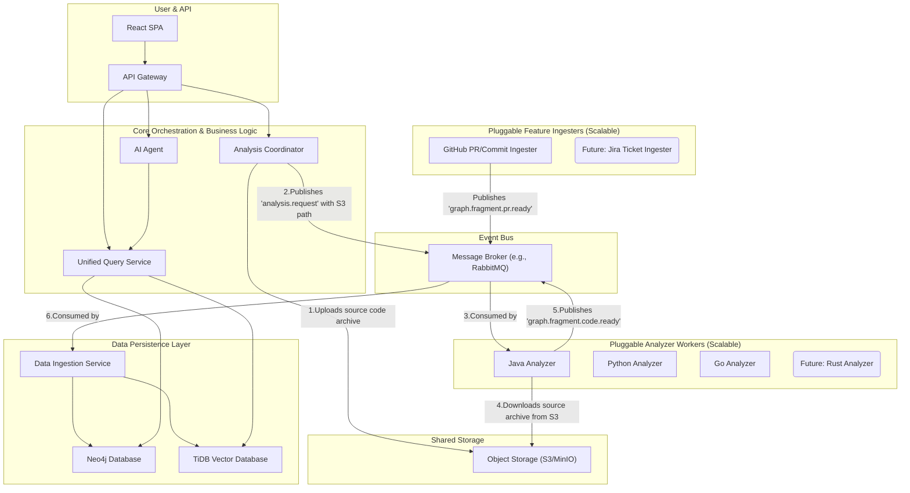

## RepoDive: Software Architecture Document

**Version:** 1.0

**Date:** 2025-08-10

### 1. Introduction and Goals

#### 1.1 Requirements

The primary requirement for RepoDive is to create a platform that significantly reduces the time and effort for developers to understand complex codebases. The system must be able to:

*   Analyze a given code repository.
*   Present the codebase in a multi-layered, interactive format.
*   Visualize the architecture, logic flow, and data flow.
*   Utilize AI to automate analysis and visualization.

#### 1.2 Quality Goals

| Quality Goal | Description |
| :--- | :--- |
| **Usability** | The platform must be intuitive and easy to navigate for developers with varying levels of experience with the target codebase. |
| **Performance** | The analysis and visualization process should be fast and responsive, even for large and complex repositories. |
| **Accuracy** | The generated visualizations and analysis must accurately reflect the structure and behavior of the codebase. |
| **Scalability**| The platform should be able to handle a large number of concurrent users and repositories. |

#### 1.3 Stakeholders

| Stakeholder | Expectations |
| :--- | :--- |
| **Software Developers** | A tool that helps them quickly understand a new or complex codebase, identify dependencies, and trace logic. |
| **New Team Members** | An onboarding tool that accelerates their understanding of the project's architecture and codebase. |
| **Software Architects** | A tool for analyzing, documenting, and communicating system architecture. |

### 2. Constraints

| Constraint | Description |
| :--- | :--- |
| **Technology Stack** | The core technologies are pre-defined: cased/kit, Neo4j, TiDB, and an AI agent. The frontend will be built with React. |
| **External Dependencies** | The system relies on the availability and performance of the specified external tools and databases. |

### 3. Context and Scope

#### 3.1 Business Context

RepoDive is a developer-facing tool designed to be used within a software development lifecycle. It interacts with code repositories from various sources (e.g., GitHub, GitLab) and provides an interactive analysis and visualization of the code.

#### 3.2 Technical Context

### 4. Solution Strategy

The core of the solution is a multi-layered approach to code visualization, powered by an AI agent. The AI agent will orchestrate the analysis process using `cased/kit` to parse the code and then populate Neo4j with the code's structure and TiDB with vector embeddings for semantic search. The visualizations will be generated on-demand and presented to the user through a React-based frontend.

### 5. Building Block View

#### 5.1 Level 1: System Components

#### 5.2 Level 2: Frontend

The frontend will be a single-page application built with React. It will be responsible for rendering the visualizations and handling user interactions.

#### 5.3 Level 3: Backend

The backend will consist of a set of microservices:

*   **API Gateway:** The single entry point for all frontend requests.
*   **AI Agent:** The "brain" of the system, responsible for orchestrating the analysis and visualization process.
*   **Code Analysis Service:** A service that interacts with `cased/kit` to analyze the code.

### 6. Runtime View

The following scenario illustrates the runtime behavior of the system when a user wants to analyze a repository:

### 7. Deployment View

The system will be deployed on a cloud platform (e.g., AWS, GCP) using containerization (e.g., Docker) and orchestration (e.g., Kubernetes). This will ensure scalability and high availability.

### 8. Crosscutting Concepts

| Concept | Description |
| :--- | :--- |
| **Logging** | A centralized logging solution (e.g., ELK stack) will be used to collect and analyze logs from all services. |
| **Monitoring** | A monitoring solution (e.g., Prometheus, Grafana) will be used to track the health and performance of the system. |
| **Security** | All communication between services will be encrypted. User authentication and authorization will be implemented. |

### 9. Architectural Decisions

| Decision | Justification |
| :--- | :--- |
| **Microservices Architecture** | Chosen for its scalability, flexibility, and ability to use different technologies for different services. |
| **Neo4j for Graph Database** | Ideal for representing and querying the complex relationships within a codebase. |
| **TiDB for Vector Database** | Provides the necessary infrastructure for semantic search and other AI-powered features. |
| **React for Frontend** | A popular and well-supported library for building interactive user interfaces. |

### 10. Quality Requirements

See Section 1.2 for a summary of the quality goals.

### 11. Risks and Technical Debt

| Risk | Mitigation |
| :--- | :--- |
| **Inaccurate Code Analysis** | The accuracy of the `cased/kit` tool is crucial. The team will need to thoroughly evaluate its performance and consider alternatives if necessary. |
| **Performance Bottlenecks** | The analysis of large codebases can be resource-intensive. The system will be designed for scalability, and performance testing will be conducted to identify and address bottlenecks. |
| **Complexity of AI Agent**| The AI agent is a complex component. Its development will be iterative, with a focus on delivering a minimum viable product (MVP) first and then adding more advanced features over time. |

### 12. Glossary

| Term | Definition |
| :--- | :--- |
| **cased/kit** | A tool for analyzing and understanding code. |
| **Neo4j** | A graph database management system. |
| **TiDB** | A distributed, hybrid transactional and analytical processing (HTAP) database. |
| **Vector Embedding** | A numerical representation of text or code that captures its semantic meaning. |
| **AI Agent** | A software entity that perceives its environment and takes actions to achieve its goals. |