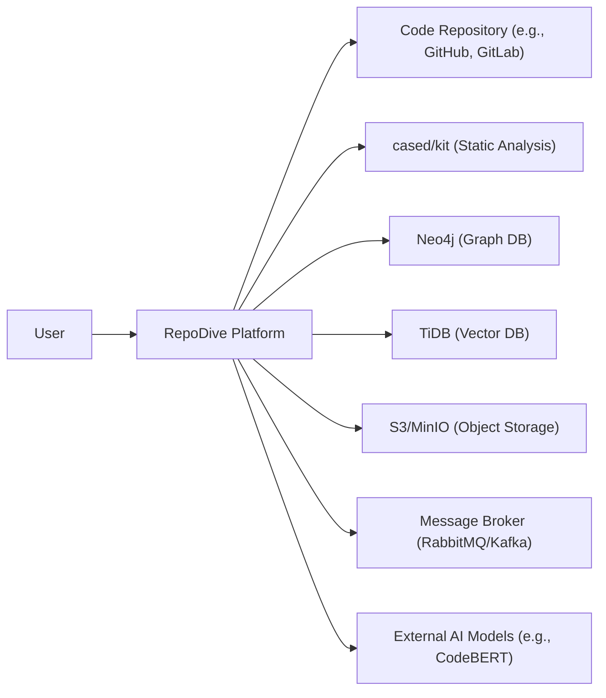
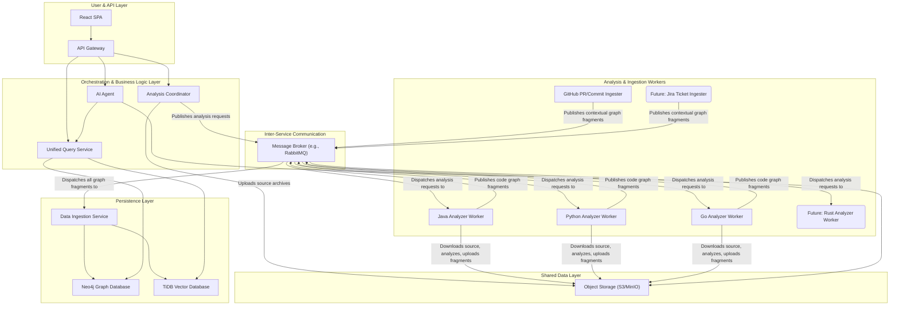
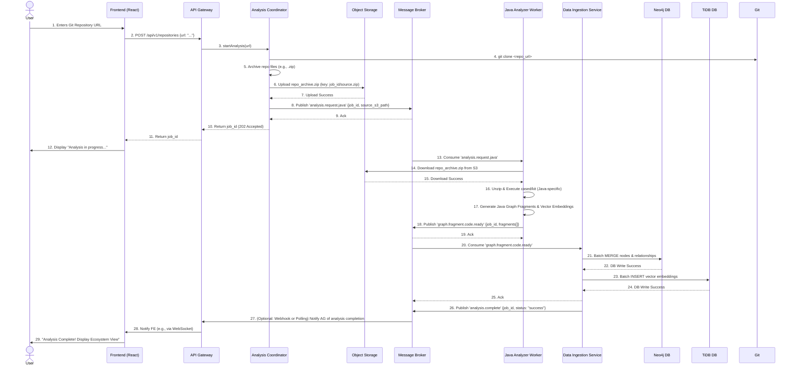
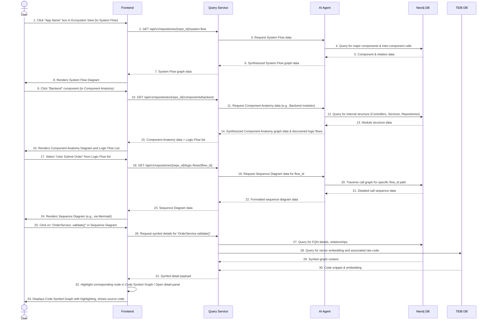

## Project Requirement Document: RepoDive

**Version:** 2.1 (Enhanced Detail)

**Date:** 2025-08-10

### 1. Introduction and Goals

#### 1.1 Requirements

The primary requirement for RepoDive is to create a platform that significantly reduces the time and effort for developers to understand complex codebases. The system must be able to:

*   **Automated Code Analysis:** Ingest, parse, and deeply analyze code repositories from various sources (e.g., Git URLs).
*   **Multi-Layered Interactive Visualization:** Present the codebase in a multi-layered, interactive format, allowing users to progressively drill down from high-level architecture to granular code details.
*   **Intelligent Flow Visualization:** Automatically infer and visualize architectural structure, logic flow, and data flow within the system.
*   **AI-Powered Code Comprehension:** Utilize AI for semantic search, pattern recognition, and contextual understanding beyond mere syntax.
*   **Modular & Extensible Design:** Ensure the backend architecture allows for easy addition of new programming languages, static analysis tools, and contextual data sources (e.g., GitHub, Jira).

#### 1.2 Quality Goals

| Quality Goal | Description | Metric (Example) |
| :--- | :--- | :--- |
| **Usability** | The platform must be intuitive and easy to navigate for developers with varying levels of experience. The learning curve for basic analysis should be minimal. | Task completion time for "Analyze new repo": < 5 minutes. |
| **Performance** | The analysis and visualization process should be fast and responsive, even for large and complex repositories. | Initial analysis for 100K LOC repo: < 5 min. UI load time for graph: < 1 sec (for loaded viewport). |
| **Accuracy** | The generated visualizations and analysis must accurately reflect the structure, relationships, and behavior of the codebase. | >90% accuracy in identifying core architectural components. |
| **Scalability**| The platform should be able to handle a large number of concurrent users and repositories without performance degradation. | Support 10 concurrent analyses. Process repos up to 1M LOC. |
| **Maintainability** | The codebase should be modular, well-documented, and easy for new developers to understand and contribute to. | Code coverage > 70%. Reduced bug fix time. |
| **Extensibility** | New programming languages or external data sources can be integrated with minimal changes to core services. | Adding a new language analyzer: < 2 person-weeks. |

#### 1.3 Stakeholders

| Stakeholder | Expectations | Key Features for Them |
| :--- | :--- | :--- |
| **Software Developers** | Quickly understand new/complex code, trace logic, identify dependencies, debug efficiently. | Multi-layered views, Logic Flow, Code Symbol Graph, Semantic Search. |
| **New Team Members** | Rapid onboarding to existing projects, accelerate understanding of architecture and codebase. | Ecosystem View, System Flow, automated documentation generation. |
| **Software Architects** | Analyze, document, and communicate system architecture, identify design patterns/anti-patterns. | Ecosystem View, System Flow, Component Anatomy, custom diagramming. |
| **Team Leads/Managers** | Overview of codebase health, identify areas for refactoring or complexity, facilitate code reviews. | High-level metrics (future), dependency mapping. |

### 2. Constraints

| Constraint | Description | Impact |
| :--- | :--- | :--- |
| **Technology Stack (Core)** | The core technologies are pre-defined: `cased/kit`, Neo4j, TiDB, and the AI agent framework. Frontend with React. | Limits alternative solutions for core data storage/processing. |
| **External Dependencies (Availability)** | The system relies on the availability and performance of external tools and services (Git providers, cloud infrastructure). | Requires robust error handling for external service failures. |
| **Scalability Requirements** | Must support analysis of very large repositories (e.g., millions of lines of code) and a growing number of users. | Mandates microservices, asynchronous processing, and horizontally scalable databases. |
| **Security & Data Privacy** | Sensitive code intellectual property must be protected. Access must be strictly controlled. | Requires strong authentication, authorization, encrypted communication, and secure storage practices. |
| **Initial Language Support** | MVP will focus on 1-2 key languages, with a clear path for others. | Prioritization of analyzer development. |

### 3. Context and Scope

#### 3.1 Business Context

RepoDive is a developer-facing SaaS platform (with potential for on-premise deployment) designed to be integrated into a software development lifecycle. It facilitates understanding across various stages: onboarding, feature development, debugging, refactoring, and architectural review. Its value proposition is directly tied to developer productivity and code quality.

#### 3.2 Technical Context

### 4. Solution Strategy

The core of the solution is a multi-layered approach to code visualization, powered by a modular AI agent and an asynchronous, event-driven microservices architecture.

1.  **Repository Ingestion:** Users submit Git URLs. An `Analysis Coordinator` handles cloning and uploads the code to shared `Object Storage`.
2.  **Pluggable Analysis Pipeline:** Language-specific `Analyzer Workers` (e.g., `JavaAnalyzer`, `PythonAnalyzer`) consume messages, download code, execute `cased/kit` (or other language-specific tools), and generate **Canonical Graph Fragments**. These fragments represent nodes and relationships.
3.  **Data Ingestion:** A `Data Ingestion Service` consumes all graph fragments and efficiently writes them to `Neo4j` (for graph structure) and `TiDB` (for vector embeddings of code semantics).
4.  **AI-Driven Insights:** An `AI Agent` queries these databases to infer architectural patterns, discover logic flows, and perform semantic searches. It leverages specialized AI models for code understanding.
5.  **Multi-Layered Visualization:** A `React SPA Frontend` dynamically renders interactive diagrams (using React Flow, Mermaid.js) based on data retrieved from a `Unified Query Service`.
6.  **Extensibility:** New languages or external data sources (like GitHub PRs, Jira tickets) are integrated as new `Analyzer` or `Ingester` microservices, producing standard graph fragments.

### 5. Building Block View

#### 5.1 Level 1: System Components (Revised and Detailed)

#### 5.2 Level 2: Frontend (Detailed)

*   **Technology:** React, TypeScript, React Router, Redux/Zustand for state management, Material-UI/Ant Design for components.
*   **Visualization Libraries:**
    *   **React Flow:** For interactive node-edge diagrams (Ecosystem, System Flow, Component Anatomy, Code Symbol Graph). Offers excellent customization, pan/zoom, and node/edge manipulation.
    *   **Mermaid.js:** For generating sequence diagrams from textual definitions. Can be integrated within React components.
    *   **D3.js (selective):** For highly custom or performance-critical visualizations if React Flow/Mermaid fall short.
    *  **Note**: Maybe will include a code view like github
*   **Component Structure:**
    *   **Layout & Navigation:** Sidebar for repository selection, top navigation for layer switching.
    *   **Diagram Viewers:** Generic components capable of rendering graph data from backend into interactive diagrams.
    *   **Detail Panels:** Collapsible/resizable panels to show source code, symbol details, search results.
    *   **Search Bar:** Global search input for natural language queries.

#### 5.3 Level 3: Backend Services (Detailed)

*   **API Gateway (Go/Envoy Proxy):**
    *   **Responsibilities:** Request routing, authentication (JWT/OAuth2), rate limiting, basic input validation.
    *   **Technology:** Go (using standard HTTP libraries) or a dedicated API Gateway solution like Envoy or Kong for advanced features.
*   **Analysis Coordinator (Go):**
    *   **Responsibilities:** Repository cloning, language detection (`linguist`), source code archiving (e.g., `tar.gz`), uploading to Object Store, publishing `analysis.request` messages.
    *   **Error Handling:** Robust retry mechanisms for Git operations and Object Store uploads.
*   **Language Analyzer Workers (Polyglot - e.g., Python for Python, Go for Go, Java for Java):**
    *   **Responsibilities:**
        *   Listen to language-specific queues (e.g., `analysis.request.python`).
        *   Download source archives from Object Store.
        *   Execute `cased/kit` (or equivalent AST/parser for the language) on the local temporary copy.
        *   Transform raw analysis output into **Canonical Graph Fragments**. This is a critical data mapping step.
        *   Generate code vector embeddings using language-specific pre-trained models (e.g., CodeBERT for Python) and include them in the fragments.
        *   Publish `graph.fragment.code.ready` messages.
    *   **Isolation:** Each worker runs in its own container/pod, ensuring dependencies don't conflict.
    *   **Error Handling:** Isolate failures per analysis job, log errors, and publish error messages to a dead-letter queue.
*   **Feature Ingestion Services (Go/Python):**
    *   **Responsibilities:** Integrate with external APIs (GitHub, Jira, etc.), fetch contextual data (PRs, commits, issues), and transform them into **Canonical Graph Fragments**.
    *   **Triggers:** Can be webhook-driven (e.g., GitHub webhooks) or scheduled polling.
    *   **Example Fragments:** Nodes for `PullRequest`, `Commit`, `User`, `JiraIssue`. Edges like `MODIFIED_IN_COMMIT`, `AUTHORED_BY`, `FIXES_ISSUE`.
*   **Data Ingestion Service (Go):**
    *   **Responsibilities:** The *only* service authorized to write to Neo4j and TiDB.
    *   Consumes `graph.fragment.ready` messages from the Message Broker.
    *   Parses Canonical Graph Fragments.
    *   Performs bulk inserts/merges into Neo4j (using `MERGE` clauses to ensure idempotency and prevent duplicate nodes/relationships) and TiDB.
    *   **Concurrency:** Designed for high-throughput, concurrent writes.
    *   **Error Handling:** Idempotent operations, retry logic for database failures, dead-letter queue for unprocessable fragments.
*   **Unified Query Service (Go):**
    *   **Responsibilities:** Provide a unified RESTful API layer for all frontend and AI Agent data requests.
    *   Translates API requests into optimized Neo4j Cypher queries and TiDB SQL queries (for vector search).
    *   **Caching:** Implement caching (e.g., Redis) for frequently accessed graph subsets or search results.
    *   **Pagination & Filtering:** Support efficient retrieval of large graph data.
*   **AI Agent (Python):**
    *   **Responsibilities:**
        *   **Architectural Inference:** Uses GNNs or heuristic algorithms on Neo4j data to identify and categorize components (FE, BE, DB, Services, Controllers, Repositories).
        *   **Logic Flow Discovery:** Traverses `CALLS` graphs in Neo4j, uses LLMs to summarize execution paths into human-readable logic flow descriptions.
        *   **Semantic Search:** Generates query vectors from natural language inputs, orchestrates vector similarity searches in TiDB, and retrieves corresponding code/docs.
        *   **Contextual Reasoning:** Combines data from Neo4j (code structure, call graphs) and TiDB (semantic embeddings) with external context (PRs) to provide richer insights.
    *   **Scalability:** Can be run as a stateless worker, with the ability to scale instances for heavy computational tasks.

### 6. Runtime View

#### 6.1 Repository Onboarding & Initial Analysis

#### 6.2 User Interaction: Navigating Abstraction Layers

### 7. Deployment View

The system will be deployed on a cloud platform (e.g., AWS, GCP, Azure) using containerization (Docker) and orchestration (Kubernetes). This ensures scalability, high availability, and efficient resource utilization.

*   **Containerization:** Each microservice (Analysis Coordinator, Analyzers, Ingesters, Data Ingester, Query Service, AI Agent, WebApp) will be packaged as a Docker image.
*   **Orchestration:** Kubernetes will manage deployment, scaling, load balancing, service discovery, and health checks of all containers.
*   **Networking:** Internal Kubernetes services will handle inter-service communication. An Ingress controller will expose the `API Gateway` to the internet.
*   **Databases:** Neo4j and TiDB will be deployed as highly available, stateful sets within Kubernetes, or as managed services from the cloud provider (e.g., AWS Neptune for Neo4j, TiDB Cloud).
*   **Object Storage:** Cloud-native object storage (S3, GCS, Azure Blob Storage) will be used.
*   **Message Broker:** A managed service for RabbitMQ or Kafka (e.g., AWS MQ, Confluent Cloud) is preferred for ease of operations.

### 8. User Stories

User stories are categorized by development phase, providing a clear roadmap for feature delivery.

#### 8.1 MVP (Minimum Viable Product) - Core Analysis & High-Level Views

**Goal:** Enable a user to analyze a single repository and explore its basic structure and external dependencies. Focus on one or two programming languages.

| ID | Title | Description | Note | Story Points |
| :-- | :-- | :--- | :--- | :--- |
| **US-MVP-001** | **Repository Onboarding & Analysis Initiation** | As a developer, I want to submit a Git repository URL so that RepoDive can begin analyzing it and provide feedback on its progress. | - Frontend: Input field, submit button, loading spinner/status message.   - Backend: `AnalysisCoordinator` receives URL, clones, uploads to Object Store, publishes analysis request, returns job ID. | 5 |
| **US-MVP-002** | **View Analysis Status** | As a developer, I want to see the current status of my repository analysis so that I know when it's ready to be explored. | - Frontend: Polling or WebSocket updates for analysis job status.   - Backend: `QueryService` endpoint for job status. | 3 |
| **US-MVP-003** | **Explore Ecosystem Context View** | As a developer, once analysis is complete, I want to see a high-level diagram of the application and its external systems (e.g., databases, third-party APIs) so that I can quickly grasp its overall context. | - Frontend: Renders a basic graph (using React Flow or Mermaid) with interactive nodes.   - Backend: `AI Agent` queries Neo4j for `ExternalDependency` nodes and key application components. First inference rule set for `AI Agent`. | 8 |
| **US-MVP-004** | **Navigate to System Flow View** | As a developer, I want to click on the "App Name" in the Ecosystem view to drill down into its major internal components so that I can understand its main architectural blocks (e.g., Frontend, Backend, Database). | - Frontend: Clicking the main app node navigates to the System Flow component.   - Backend: `AI Agent` has initial rules to categorize internal files/packages into generic "Frontend", "Backend", "Database" components based on common patterns/dependencies. | 8 |
| **US-MVP-005** | **Basic Code Symbol Graph Browsing** | As a developer, I want to see a raw graph of functions, classes, and their basic relationships (calls, inheritance) within a specific file or module so that I can understand granular code structure. | - Frontend: Renders a large, filterable graph using a powerful library (e.g., Cytoscape.js/React Flow). Initially, simple filtering by type.   - Backend: `QueryService` directly queries Neo4j for all symbols within a given scope (e.g., a file, or component). | 13 |
| **US-MVP-006** | **View Raw Code from Symbol Graph** | As a developer, I want to click on a node in the Code Symbol Graph to view its corresponding source code snippet so that I can inspect the actual implementation. | - Frontend: Dedicated code viewer panel that updates on node selection.   - Backend: `QueryService` fetches raw `code_text` from TiDB (or direct file access if `cased/kit` output includes it). | 5 |
| **US-MVP-007** | **Language Analyzer (Initial Support: Python)** | As a system administrator, I want a Python Analyzer worker to be deployed and functional so that Python repositories can be analyzed. | - Backend: Dedicated Python Analyzer service containerized. Uses `cased/kit` (or Python AST libraries) to generate canonical fragments and basic vector embeddings for functions/classes. | 13 |

#### 8.2 Phase 1: Enhanced Core Functionality & First AI Features

**Goal:** Improve usability across layers, introduce foundational AI-driven logic flow and semantic search, and expand language support.

| ID | Title | Description | Note | Story Points |
| :-- | :-- | :--- | :--- | :--- |
| **US-P1-001** | **Explore Component Anatomy View** | As a developer, I want to explore a specific component (e.g., "Backend") to see its internal modules (e.g., "Controllers", "Services", "Repositories") so that I can understand its internal architecture. | - Frontend: New diagram view for component details.   - Backend: `AI Agent` applies more granular pattern recognition within a component's subgraph (e.g., based on naming conventions, folder structure, call patterns). | 8 |
| **US-P1-002** | **View Manual Triggered Logic Flow (Basic)** | As a developer, I want to select a pre-defined "logic flow" (e.g., "User Login") to see its execution sequence as a diagram, so I can trace a specific interaction. | - Frontend: Displays a list of example logic flows. On selection, renders a sequence diagram.   - Backend: For MVP, these flows can be *hardcoded* examples or manually configured entry points, with `AI Agent` performing graph traversal only for the sequence. | 13 |
| **US-P1-003** | **Basic Natural Language Code Search** | As a developer, I want to search for code using natural language phrases (e.g., "how users are created") instead of exact keywords so that I can find relevant code even with vague recollection. | - Frontend: Search bar that sends natural language queries.   - Backend: `AI Agent` converts query to vector, performs vector similarity search in TiDB, `QueryService` returns top N results with `symbol_fqn` and `code_text`. | 8 |
| **US-P1-004** | **Interactive Highlighting: Logic Flow to Symbol Graph** | As a developer, when viewing a Logic Flow sequence diagram, I want the corresponding nodes in the Code Symbol Graph to be highlighted so that I can see the exact code elements involved in that flow. | - Frontend: The Sequence Diagram component sends a list of FQNs to the Symbol Graph component, which then highlights them. | 5 |
| **US-P1-005** | **Language Analyzer (Add Go Support)** | As a system administrator, I want a Go Analyzer worker to be deployed and functional so that Go repositories can also be analyzed. | - Backend: New Go Analyzer service. Adapts `cased/kit` or uses Go-specific parsing tools. Generates canonical fragments and vector embeddings for Go code. | 13 |
| **US-P1-006** | **Improved Symbol Graph Filtering** | As a developer, I want to filter the Code Symbol Graph by node type (e.g., only "Classes", "Functions") or by name so that I can focus on specific parts of the graph. | - Frontend: Filter options in the Symbol Graph view.   - Backend: `QueryService` supports additional Cypher query parameters for filtering based on node labels and properties. | 5 |

#### 8.3 Phase 2: Advanced AI & Contextualization

**Goal:** Deepen AI capabilities, automate discovery, and integrate external development context.

| ID | Title | Description | Note | Story Points |
| :-- | :--- | :--- | :--- | :--- |
| **US-P2-001** | **AI-Driven Logic Flow Discovery (Automated)** | As a developer, I want RepoDive to automatically identify common logic flows (e.g., user registration, order processing) without manual configuration so that I can quickly understand key system operations. | - Backend: `AI Agent` uses advanced graph traversal algorithms and LLMs to identify common entry points and significant execution paths, then summarizes them. This is a complex AI task. | 21 |
| **US-P2-002** | **Find Similar Code / Logic Duplication** | As a developer, I want to select a function/method and find other semantically similar code snippets across the codebase so that I can identify refactoring opportunities or potential duplicate logic. | - Frontend: "Find Similar" context menu action on code symbols.   - Backend: `AI Agent` retrieves vector for selected symbol from TiDB and performs a K-nearest neighbors search. | 13 |
| **US-P2-003** | **Code-to-Documentation Linking** | As a developer, I want to link natural language documentation (e.g., from `README.md` or wiki pages) to relevant code sections so that I can quickly jump from conceptual understanding to implementation details. | - Backend: Ingester for markdown files, vectorizing documentation. `AI Agent` performs semantic similarity search between doc vectors and code vectors in TiDB. | 13 |
| **US-P2-004** | **GitHub Pull Request & Commit Integration** | As a developer, I want to see which code changes were introduced by a specific GitHub Pull Request or commit directly linked within the Code Symbol Graph so that I can understand the history and context of code modifications. | - Backend: `GitHubIngester` service polls/receives webhooks for PRs/commits, generates `Commit`, `PullRequest`, `User` nodes and `MODIFIED_IN_COMMIT` edges in canonical fragment format. | 21 |
| **US-P2-005** | **Language Analyzer (Add Java Support)** | As a system administrator, I want a Java Analyzer worker to be deployed and functional so that Java repositories can also be analyzed. | - Backend: New Java Analyzer service. Leverages Java-specific `cased/kit` capabilities or AST parsers like JavaParser. | 13 |
| **US-P2-006** | **Interactive Layer Linking (e.g., Component to Symbol Graph)** | As a developer, I want clicking a component (e.g., "Controllers") in the Component Anatomy view to highlight all related symbols in the Code Symbol Graph, providing a seamless transition. | - Frontend: Passes component's scope/list of FQNs to the Symbol Graph view for dynamic highlighting. | 5 |

#### 8.4 Phase 3: Refinement & Collaboration

**Goal:** Enhance the user experience, provide advanced insights, and enable team collaboration.

| ID | Title | Description | Note | Story Points |
| :-- | :--- | :--- | :--- | :--- |
| **US-P3-001** | **AI-Powered Refactoring Suggestions** | As a developer, I want RepoDive to suggest potential code refactorings (e.g., extracting methods, simplifying logic) based on analysis of complexity and duplication so that I can improve code quality. | - Backend: `AI Agent` uses advanced static analysis metrics and pattern recognition to identify refactoring candidates and generates actionable suggestions. | 21 |
| **US-P3-002** | **Team Collaboration: Shared Views** | As a team lead, I want to save a specific view (e.g., a filtered Symbol Graph or a highlighted Logic Flow) and share it with my team members so that we can collaboratively discuss and understand code. | - Frontend: Save/share UI.   - Backend: `QueryService` stores view configurations in a dedicated metadata store (e.g., PostgreSQL). | 13 |
| **US-P3-003** | **Team Collaboration: Annotations & Comments** | As a developer, I want to add notes or comments directly onto graph nodes or edges within RepoDive so that I can document insights or questions for my team. | - Frontend: Annotation UI.   - Backend: `DataIngester` can handle `Annotation` nodes and `HAS_ANNOTATION` edges in Neo4j, linked to specific code symbols. | 8 |
| **US-P3-004** | **CLI Integration for Local Analysis** | As a developer, I want to analyze a local repository from my command line without uploading it to the cloud service so that I can get quick, private insights during development. | - Backend: Potentially a local `AnalysisCoordinator` and `Analyzer` bundle that can be run on premise, or a `cased/kit` wrapper with direct local output. Requires careful consideration of data persistence for the local mode. | 13 |
| **US-P3-005** | **Jira Ticket Integration** | As a developer, I want to see relevant Jira tickets (e.g., bug reports, feature tasks) linked to the code components or logic flows that implement them so that I can quickly get business context. | - Backend: `JiraIngester` service fetches/receives Jira data and maps it to code. | 13 |

### 9. Architectural Decisions

| Decision | Justification | Impact/Alternatives |
| :--- | :--- | :--- |
| **Microservices Architecture** | Chosen for its scalability, flexibility, independent deployment, and ability to use different technologies for different services (e.g., Go for performance, Python for AI). | Increases operational complexity (networking, monitoring, logging). Alternative: Monolith (simpler deployment, harder scaling). |
| **Event-Driven Communication (Message Broker)** | Decouples services, enables asynchronous processing, improves resilience (retries, dead-letter queues), and simplifies adding new consumers/features. | Adds complexity of message broker management. Alternative: Direct synchronous HTTP calls (tighter coupling, less resilient). |
| **Object Storage for Source Code Transfer** | Solves the shared state problem in a distributed environment. Highly scalable, decoupled, and efficient for large file transfers. | Requires robust error handling for upload/download. Alternative: Shared Persistent Volumes (less flexible for cloud, requires manual cleanup). |
| **Neo4j for Graph Database** | Ideal for representing and querying the complex, highly interconnected relationships within a codebase (calls, inheritance, imports). Efficient for graph traversal. | Steep learning curve for Cypher. Less suitable for simple key-value or relational data. |
| **TiDB for Vector Database** | Provides necessary infrastructure for semantic search and other AI-powered features. Its HTAP capabilities simplify architecture by combining transactional and analytical workloads. | Still a relatively new area; performance may need fine-tuning for very high-dimensional vectors at scale. Alternative: Dedicated vector DB (e.g., Pinecone, Weaviate). |
| **Python for AI Agent** | Leveraging Python's rich ecosystem of AI/ML libraries (TensorFlow, PyTorch, Hugging Face) and data science tools. | Requires robust deployment strategy for Python services in production. |
| **Go for Core Services (Coordinator, Ingester, Query)** | Excellent for high-performance, concurrent, I/O-bound microservices due to goroutines and channels. Compiles to single static binary. | Higher development effort compared to Python for some tasks. |
| **React for Frontend** | A popular and well-supported library for building interactive, component-based user interfaces. Large community and ecosystem. | Requires strong frontend engineering expertise. |
| **Canonical Graph Fragment Data Format** | Standardized contract between analyzer/ingester services and the `DataIngester`. Ensures modularity and extensibility. | Requires careful design and versioning of the schema. |

### 10. Quality Requirements

See Section 1.2 for a detailed summary of the quality goals.

### 11. Risks and Technical Debt

| Risk | Mitigation Strategy | Technical Debt Implications |
| :--- | :--- | :--- |
| **Inaccurate Code Analysis (cased/kit)** | - Thorough evaluation of `cased/kit`'s accuracy for target languages.   - Implement robust validation rules for `Canonical Graph Fragments`.   - Consider fallback parsers for specific language constructs if `cased/kit` is insufficient. | - Need for ongoing maintenance/updates to analysis tooling.   - Potential for "dirty" graph data requiring cleanup if fragments are malformed. |
| **Performance Bottlenecks with Large Codebases** | - Implement batching for database writes/reads.   - Optimize Cypher queries (indices).   - Horizontal scaling of Analyzer, Ingester, Data Ingester, and Query Service.   - Efficient data streaming/pagination for UI.   - Aggressive caching at Query Service and Frontend. | - Over-optimization in early stages can lead to premature complexity.   - Requires dedicated performance testing environment and load testing. |
| **Complexity of AI Agent & Models** | - Iterative development: Start with heuristic rules, then integrate simpler LLMs, then more complex GNNs.   - Leverage pre-trained models where possible (e.g., CodeBERT).   - Strict versioning and deployment strategies for AI models. | - Rapidly evolving field requires continuous learning/adaptation.   - Debugging AI-driven insights can be challenging ("black box"). |
| **Data Synchronization & Consistency Across DBs** | - `Data Ingestion Service` is the single writer to Neo4j & TiDB to maintain consistency.   - Use idempotent operations (Neo4j `MERGE`).   - Transactional boundaries within `Data Ingester`. | - Potential for eventual consistency if not designed carefully.   - Debugging data discrepancies between graph and vector store could be complex. |
| **Resource Costs (Cloud)** | - Efficient resource utilization (e.g., right-sizing containers).   - Auto-scaling policies for services.   - Lifecycle policies for Object Storage (delete old archives).   - Monitoring cloud spend. | - Requires ongoing cloud cost optimization efforts.   - Potential for high egress costs with large repo downloads. |
| **Managing Polyglot Analyzer Toolchain** | - Standardized interfaces for analyzers (e.g., CLI, gRPC).   - Robust containerization for each analyzer, managing specific language dependencies.   - Clear guidelines for developing new analyzers. | - Increased complexity in CI/CD pipelines.   - Different debugging tools/environments for each language. |

### 12. Glossary

| Term | Definition |
| :--- | :--- |
| **AI Agent** | A software entity that perceives its environment and takes actions to achieve its goals within RepoDive, often utilizing machine learning models. |
| **Canonical Graph Fragment** | A standardized JSON format representing a small, self-contained piece of the overall codebase graph (nodes and relationships), used for inter-service communication. |
| **cased/kit** | An underlying third-party static code analysis toolkit used by RepoDive's Analyzer Workers to extract raw code information and build Abstract Syntax Trees (ASTs). |
| **HTAP** | Hybrid Transactional/Analytical Processing; a database capability (like TiDB offers) to handle both real-time transactional workloads and complex analytical queries efficiently. |
| **LLM** | Large Language Model; a type of AI model used by the AI Agent for tasks like code summarization, naming logic flows, and natural language understanding. |
| **Neo4j** | A native graph database management system used by RepoDive to store the complex, interconnected relationships between code symbols, files, and architectural components. |
| **Object Storage** | A highly scalable and durable data storage service (e.g., Amazon S3, MinIO) used by RepoDive for storing temporary source code archives. |
| **RepoDive** | The name of the codebase analysis platform described in this document. |
| **TiDB** | A distributed, HTAP database used by RepoDive specifically for storing and querying vector embeddings of code for semantic search and similarity functions. |
| **Vector Embedding** | A numerical representation (a high-dimensional vector) of text or code generated by an AI model, designed to capture its semantic meaning and contextual relationships. |

---